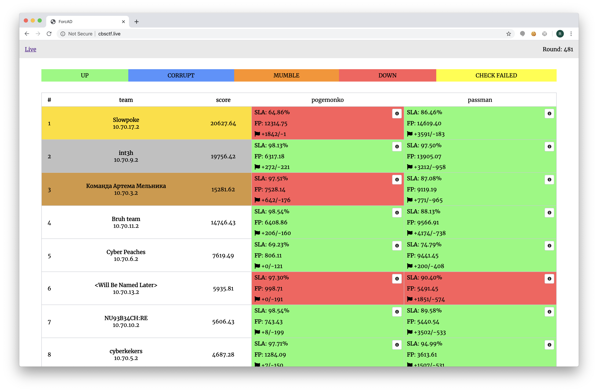

# innoctf-teazer-01-03-2020
InnoCTF School A&amp;D Attack-Defence training sources, checkers and sploits.

## Results

[Full scoreboard](scoreboard/full.png)

## Services

| Service | Lang | Checker | Sploits | Author |
|--------|------|-------|---------|-------|
| **[pogemonko](services/pogemonko/)** | C | [Checker](checkers/pogemonko/) | [Sploits](sploits/pogemonko/) | [@kekov](https://github.com/xmikasax) |
| **[passman](services/passman/)** | Python | [Checker](checkers/passman/) | [Sploits](sploits/passman/) | [@pomo_mondreganto](https://github.com/pomo-mondreganto) |

## Infrastructure

- DevOps, infrastructure author: [@pomo-mondreganto](https://github.com/pomo-mondreganto).
- Checksystem: [ForcAD](https://github.com/pomo-mondreganto/ForcAD)

